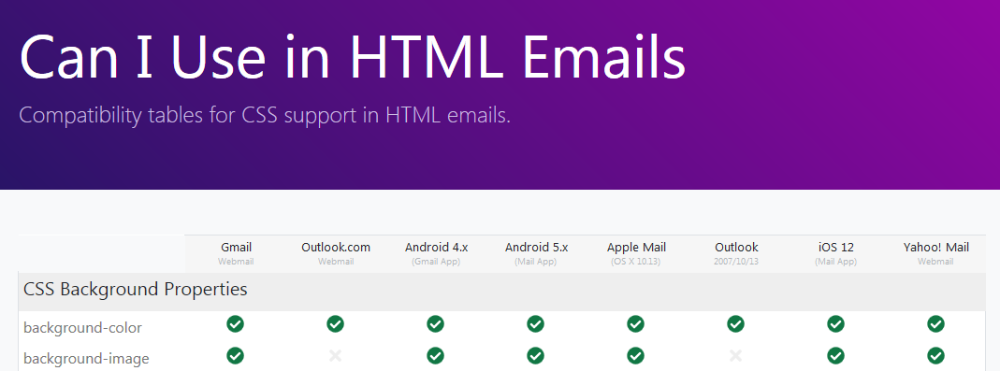

# caniuse.email   

[caniuse.email](https://caniuse.email) started because people need a better way to find what css is supported by different popular email clients.  This project is here to help track that information.

## Installation

You can just fork this project and work on it in you're repo since it's just standard HTML.

### Requirements
* Github Account
* Web Browser

## Contributing
Pull requests are welcome. For major changes, please open an issue first to discuss what you would like to change.

## License
[MIT](https://choosealicense.com/licenses/mit/)